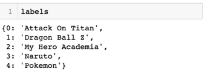

# Mod-4-Project-CNN Anime Classification

## Project Goals

* Create a CNN model that can differentiate and classify different anime shows. We started with a binary model of two anime shows, and gradually moved to a multi-class categorical model.

## Data Gathering

We first used code to webscrape images from google by specifying “keywords” or search tags. Each keyword has a limit of 100 pictures that can be scraped from google. We used 5 keywords per show, leading to about 500 images per class. The pictures are scraped into a “downloads” folder, and separated into subfolders named after the scraped “keywords”.

Next, we used a code that split the image folders into a .8/.2 train/test folders in a master “dataset” folder.

## Data Cleaning 

Unfortunately we had to manually go through all the pictures to see if all of them can open and the file is not corrupt. Also, the more pictures you scrape from google images, the less relevant to the searched “keyword” they gradually become. 

## Baseline Binary Model

We built a baseline model with just one convolutional layer. To create non-linearity we use the **Relu Activation Function**, which is the most commonly used for image classification.
 
The next layer is the **Max Pooling Layer**—this brings the size of the pooling map from 3x3 to 2x2, thus reducing the complexity of the model.
 
After that we flatten the layers and create **a fully connected layer with a binary output layer**—a yes or a no for a class. We used the **Sigmoid Activation Function** since it seems to be the best for binary classification. 

### Data Augmentation

**Image Data Generator** creates batches of the images, and for each batch it applies some random transformations to them so we'll get many more diverse images within these batches. 

Similarly to the Pikachu above, the **Image Data Generator** looks at the images from different angles and slightly different color hues to create more data.

### Results

With these graphs we can see how quickly our baseline model is overfitting. The dotted lines show our training data and the full lines are from our testing over a series of Epochs. 

On the left, we can see that as we move through Epochs in our model, the loss values decrease for our training set, but for our testing the lose continuously increases. 

On the right, we see that the training set has the desired accuracy outcome, but in our testing, the first break around 2 Epochs shows that it is quickly becoming overfit as the training accuracy reaches 1. 

Though the model is getting an 80% accuracy rate, it was clearly overfit.

Our next goal was to fix the overfitting problem while adding more classes.

## Making Multi-Class Model

The structure of creating a Multi-Class model is similar to the baseline binary one, except we need to change the activation function to `softmax`, which is optimized for multi-class models. Furthermore, had to change some of the parameters from **binary** to **categorical** , including the way we calculate our model loss; changing it from `binary_crossentropy` to `categorical_crossentropy`.

## Final Model

* Training Set: 1568 images belonging to 5 classes.
* Testing Set: 396 images belonging to 5 classes.

### EDA

  

Class imbalance was not a critical issue for this model, but moving forward as we attempt to gather more data, it should be addressed.

### Model Structure and Layers

* The model ended up having a total of 5 **Convolutional** layers, with and initial output shape of 256x256.

* We also added 6 **Dropout** layers to help with overfitting. All layers are a 20% dropout, except the final one with 50% dropout.

* Finally, we also added 6 **Batch Normalization** layers, to help the model run smoother and faster (allegedly). 

### Results 

The final model had 76.5% accuracy and a .71 loss, which is not bad at all considering the time constraints. As you can see above, we’ve definitely **fixed the overfitting issue**, what a beautiful graph!

The results of the model can be shown in two ways; on the left you can see a dataframe with the actual picture and class under the `Filename` column, and the model’s prediction in the `Predictions` column. On the right, the dataframe shows how it made the classification decision for every picture in the testing set. 

For example, for the first picture, it predicted that there’s a 40% likelihood that the given picture is `Naruto`, which is the highest likelihood predicted. 

### Confusion Matrix

The confusion matrix shows that for the testing set, the model did not actually predict at a 76% accuracy rate, but we believe that is a result of a the very small testing sample that we gave the model (396). Theoretically, if the model tested thousands of pictures, the overall accuracy will eventually reach 76%.

### Predictions

In order to further test the model, we built a function that takes in our final model, and a whatever picture you’d like to input. The function reshapes the picture to similar parameters as the pictures that the model was trained on, and outputs a prediction:

  

In the first picture, the model gave an accurate prediction of 74% likelihood that the image is from `Dragon Ball Z`.

In the second picture, the model gave an accurate prediction of 69% likelihood that the image is from `Dragon Ball Z`.

### Next Steps

* Get more data.
* Add more layers.
* Figure out how to get cosine similarity between the classes.
* Run models that would take longer to complete.

